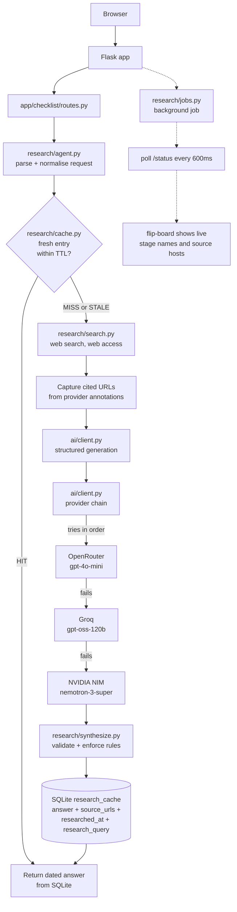

# Kaagaz

**Ask about any Indian banking, loan or document transaction. Kaagaz researches it live, shows every step in order with costs and who regulates it, and cites the sources it actually read.**

Built with IBM Bob 2.0 for the lablab.ai hackathon, 25–27 September 2026.

---

## 1. Overview

Kaagaz is a **research agent**, not a lookup table.

The obvious way to build this — and the way most "document checklist" products
are built — is to hand-curate a dataset: someone decides which transactions
matter, writes the list, and ships it. That approach has a ceiling that is set
by the curator's imagination, not by the user's problem. It covers the four
transactions somebody thought of, and it goes stale the moment a bank changes
its fee schedule.

Kaagaz inverts that. You describe the transaction in free text, name a bank and
a state if you have them, and say who the applicant is. Kaagaz checks a cache,
and on a miss it **searches the live web, reads what it finds, and builds the
checklist from those sources** — then files the result with every URL it used.

The consequence is the actual product claim: Kaagaz is not limited to the
transactions somebody pre-selected. It handles a home loan, a Kisan Credit Card
renewal, a gold loan for a senior citizen at a specific post office, or a
transaction nobody has ever asked about before. The pre-warmed cache exists to
make the common cases instant and to survive a flaky connection — it is a
floor, not a ceiling, and the app says so on its own front page.

---

## 2. Problem and Motivation

In India, every routine banking and financial transaction — a home loan, opening
an NRE account, registering a sale deed, a gold loan, a Mudra loan — demands a
specific bundle of documents, attestations, stamps and government forms. The
requirements are scattered across bank websites, RBI circulars, state stamp-duty
schedules and registrar notices. They are rarely presented in one place, in the
right order, with real costs attached.

The failure mode is specific and expensive: people discover what is missing
when they are **already at the counter**. That means a second trip, a missed
appointment, or in some cases a missed financial deadline entirely.

Two things make this worse than a general information problem:

**Nobody agrees on who regulates what.** The RBI regulates KYC, account-opening
norms, FEMA and loan-processing standards. State governments regulate stamp
duty, registration fees and adhesive stamps. These are routinely conflated —
by banks, by aggregators, and by language models — and it matters, because
"the RBI says you need ₹4,000 of stamp duty" is a sentence that sends someone
to entirely the wrong office.

**Two distinctions cause most of the confusion.** See [Section 7](#7-the-two-distinctions-that-cost-people-money).

---

## 3. Architecture

### 3.1 Request flow



### 3.2 The sequence a question goes through

This is the diagram that matters — it is the cache-first branch that makes the
product both instant and honest.

```mermaid
sequenceDiagram
    autonumber
    actor U as User
    participant B as Browser
    participant F as Flask
    participant C as research_cache (SQLite)
    participant S as Web search
    participant G as AI generation

    U->>B: "loan against FD at SBI, as an NRI"
    B->>F: GET /checklist?transaction_type=...&bank=...&residency=nri
    F->>F: normalise (sbi -> State Bank of India;<br/>"loan against FD" -> canonical form)
    F->>C: SELECT by cache_key

    alt Fresh entry exists (age <= cache_ttl_days)
        C-->>F: answer + source_urls + researched_at
        F-->>B: 200, full checklist
        Note over B: rendered in ~1ms.<br/>Badged "cached answer",<br/>dated, sources listed
    else Miss or stale
        C-->>F: nothing usable
        F-->>B: 200, "researching" view
        Note over B: flip-board shows the LIVE stage<br/>names and source hosts.<br/>Nothing here is simulated.

        B->>F: POST /api/research/start
        F-->>B: 202 { job_id }

        loop every 600ms while running
            B->>F: GET /api/research/status/&lt;job_id&gt;
            F-->>B: stage, elapsed, citations so far
            Note over B: ticker + source pills update<br/>as they are actually discovered
        end

        F->>S: research prompt (transaction,<br/>bank, state, residency)
        S-->>F: findings + the URLs actually read
        F->>G: findings + citations -> strict JSON
        G-->>F: structured checklist
        F->>F: validate; correct RBI vs<br/>stamp-act misattribution;<br/>drop unsourced figures
        F->>C: INSERT answer, source_urls,<br/>researched_at, research_query
        F-->>B: done + answer
        B->>F: re-request the page (now a cache hit)
        F-->>B: the rendered checklist
    end
```

### 3.3 How it searches

The search step is a direct, keyless pipeline rather than a paid search API:

1. **Find.** DuckDuckGo's keyless HTML endpoints return result titles and URLs.
2. **Read.** The top five pages are fetched in parallel and stripped to text.
3. **Cite.** Only URLs that actually returned readable text become sources.

The synthesis step then receives **the real page text**, not another model's
summary of it. That is better grounding than a web-enabled model gives you, and
it means the citation list is exactly the set of pages that were read — nothing
is cited that was not opened.

A second query biased at the named bank's own site runs when the first did not
already surface an authoritative source, because a generic query for "home loan
documents required" is dominated by SEO listicles. Results are then ranked:
a regulator, then the bank's own product page, then everything else. An
unknown bank is still researched — it simply ranks by its own name match.

Two backends sit behind that:

- **Direct search (primary, no key).** As above.
- **Model-native web access (fallback).** An OpenRouter `:online` model. Used
  when the direct path is blocked or rate-limited, and it needs a funded key.

DuckDuckGo throttles aggressively and answers a blocked request with **HTTP 202
and a challenge page** rather than an error. That is detected explicitly, and a
throttled query is retried with backoff before giving up and falling through to
the second backend. A throttle is never reported as "no results".

### 3.4 The generation chain

`app/ai/client.py` holds an ordered registry of chat-completion providers.
`generate()` and `generate_json()` walk it and take the first usable answer.
Adding a provider is adding one entry.

| Order | Provider | Key | Why there |
|---|---|---|---|
| 1 | OpenRouter | `OPENROUTER_API_KEY` | Best quality for the structured research prompt (`gpt-4o-mini`). Needs a funded key. |
| 2 | **Groq** | `GROQ_API_KEY` | Very fast, useful free tier. Measured 0.9s with valid JSON. |
| 3 | NVIDIA NIM | `NVIDIA_NIM_API_KEY` | Works free, slowest of the three. Solid last resort. |

Three behaviours this registry exists to guarantee:

- **A provider with no key is skipped, not called and failed.** An
  unauthenticated round trip on every request is pure waste.
- **A provider that is out of credit or rate-limited is tripped out of the
  rotation** for five minutes. The OpenRouter key here is a free tier with no
  credit, so without this every generation opened with a guaranteed 402. The
  chain now goes straight to whichever provider can actually answer. Only
  terminal statuses trip it — `401/402/403/404/410/429`. A `500` is one bad
  call, not grounds for abandoning a provider. After the grace period a
  provider is retried, because a key can be topped up mid-session and nothing
  signals that except trying again.
- **Groq's model list is discovered, not hardcoded.** This is not theoretical:
  `llama-3.3-70b-versatile` and `llama-3.1-8b-instant` — the two slugs a
  hardcoded list would have named — **do not exist** on this account. The list
  is fetched from `/models`, filtered to instruction-following families, and
  ordered by preference. Moderation models (`*-guard-*`, `*-safeguard-*`) and
  speech models are excluded, since one of those answering a JSON request looks
  like a successful call and returns nonsense.

`GET /api/research/health` reports each provider's key presence and trip state,
so "why is it slow" is a question with an answer.

### 3.5 Why search and generation are separate steps

A model with web access is only available on one provider. Coupling search to
generation would mean a search-tier outage also killed generation. Splitting
them means:

- search availability and generation availability are **independent failures**
- the raw findings survive in the audit trail, so if structuring fails the user
  still gets a real, sourced answer in prose rather than an error page
- we control exactly which sources get cited, instead of hoping the model
  cites the ones we would have chosen

Both steps degrade separately. Search failure with a stale entry returns the
stale answer, clearly labelled with its date. Search failure with nothing
cached returns a specific, retryable message. Generation failure still returns
the researched text with its sources attached.

### 3.6 Repository layout

```
kaagaz/
  app/
    __init__.py            Flask app factory
    checklist/routes.py    Page routes: ask, result, about
    research/
      refdata.py           Banks, states, categories, residency + normalisation
      cache.py             research_cache table: read, write, freshness, stats
      search.py            Step 1 — web search, citation capture
      synthesize.py        Step 2 — strict JSON, honesty rules enforced in code
      agent.py             Orchestration: cache -> research -> store -> answer
      jobs.py              Background job registry with inline fallback
      routes.py            JSON API
    ai/client.py           OpenRouter -> NVIDIA NIM chain, plain + JSON modes
    data/
      seed_research.py     The pre-researched seed set, with real source URLs
      dataset.json         Phase-1 static dataset (inline explainer + fallback)
    static/css/main.css    Design system
    static/js/             flipboard.js, checklist.js
    templates/             base, index, checklist, researching, about, _icons
  scripts/preseed.py       Pre-warm / refresh the cache
  tests/                   133 Python tests + 2 browser gates
  .aimem/                  Persistent cross-agent context and decision log
```

---

## 4. The data model

`research_cache` is simultaneously the cache and the audit trail. One row is
one researched answer.

| Column | Purpose |
|---|---|
| `bank` | Free text, normalised against a 72-entry reference list. **Unknown banks pass through** — a bank we have never heard of is a bank to research, not reject. |
| `applicant_residency_status` | Enum: `resident`, `nri`, `mixed_resident_nri`, `all_nri`, `not_applicable` |
| `loan_or_transaction_type` | Free text, normalised against ~90 known aliases by **exact match only** |
| `state` | Free text, normalised against all 36 states and UTs, plus two-letter codes |
| `interest_rate_range` | Always a band (`"7.75% - 13.20% p.a."`), never a single number |
| `processing_fee_note` | Free text; "not publicly disclosed" when the bank does not say |
| `researched_at` | When this specific answer was last researched |
| `source_urls` | Every URL used, however many |
| `research_query` | The exact query sent, kept for debugging and honesty |
| `cache_ttl_days` | How long before this entry is considered stale |
| `is_seed` | Distinguishes pre-warmed content from live research |

Because the row carries the query, the timestamp and the sources, the app can
show a user the complete provenance of any answer on demand — there is a
"show the exact research record" panel at the foot of every result.

### Freshness policy

Document requirements move in months. Interest rates move in weeks. A single
researched entry bundles both, so the entry takes the **shorter** window: 7
days. Both windows are named constants (`TTL_DOCUMENTS_DAYS = 30`,
`TTL_RATES_DAYS = 7`) and the effective TTL is stored per row, so the policy can
be made per-field later without a schema change.

Seeds are given the longer 30-day window: the research is real but deliberately
frozen, and document lists are the slow-moving part.

---

## 5. Accuracy: what the app refuses to do

These are enforced in code where possible, not merely requested in a prompt,
because they are the failure modes that actually matter.

**Stamp duty is never attributed to the RBI.** This is the single most common
error in the domain, and language models make it confidently. After generation,
any item filed under `rbi` whose text is plainly a stamp-duty, registration,
mutation or registrar matter is re-filed to `state_stamp_act` or `registrar`
(`synthesize.py::_fix_state_misattribution`). The prompt asks for the right
answer; the code guarantees it.

**No invented figures.** A cost the model could not source becomes the explicit
string *"not publicly disclosed — contact the bank directly"*. Inverted cost
ranges are repaired; unparseable and absurd values are clamped or dropped to
`null`; nothing is filled in to look complete.

**Interest rates are always bands.** Actual pricing depends on credit score,
amount and tenure, so a single percentage would be actively misleading.

**Unknown values pass through.** A closed enum of banks and products would
reject exactly the long-tail questions that demonstrate the product exists. The
reference lists exist for spelling correction and cache-key canonicalisation,
never for validation.

**Every answer is dated and sourced.** "Researched 26 September 2026", the
source list, and a visible disclaimer that this is not legal or financial
advice.

---

## 6. The design

Two layers, deliberately combined.

**Collage layer (atmosphere).** Warm cream paper with a fine irregular grain,
torn-paper deckle dividers between major sections, and a small number of
hand-placed decorative elements — a paperclip on the ask card, an ink stamp, a
wax seal. Each sits next to the content it annotates; none is scattered as
filler.

**Vector layer (function).** Every icon is a custom SVG drawn for this app: 33
glyphs, all on the same 24×24 grid, all **fully outlined** with a single
stroke width of 1.75 and round caps and joins. No icon pack is used anywhere,
because mixing one in is what makes an interface read as assembled rather than
designed. The four regulatory buckets get their own glyphs — a seal for RBI
rules, a stamp for the state stamp act, a document for the registrar, a shop for
bank policy.

**Grid discipline.** Spacing is an 8px scale — 8, 16, 24, 32, 48, 64 — with no
other value appearing in any margin, padding or gap. Three corner radii, two
shadows. Type is Fraunces for headings and Inter for body, with a 68ch measure
and line heights on the scale.

**The flip-board.** The signature component, and the one that has to be
pixel-perfect because it is the centrepiece of the demo video. Numbers render
as split-flap digit cells sized in `ch` units off a monospace face, so `1` and
`8` occupy identical space. Both counters are pinned server-side to the digit
width of the total, so the board cannot shift when the count crosses from one
digit to two. A status badge carries a 112px minimum, sized by measurement to
hold its longest label. Progress survives a reload via `localStorage`.

This is all verified mechanically rather than by eye — see [Section 9](#9-testing).

---

## 7. The two distinctions that cost people money

**Resident, NRI, and the awkward middle.** An *ordinary resident* is taxed in
India on worldwide income and needs no FEMA paperwork. An *NRI* is an Indian
citizen living abroad, and banks require a valid work permit, an employment
contract attested if it is not in English, and six months of overseas bank
statements instead of Indian ones. SBI's NRI home loan product is explicit that
the Indian income-tax return is waived for NRIs in Middle East countries and for
Merchant Navy employees. The genuinely confusing case is the **mixed household** —
someone resident by status who also earns or holds money from abroad, where
Indian tax-residency rules and FEMA remittance rules can both apply at once. An
**all-NRI joint loan** is the hardest version, because every applicant and every
guarantor is overseas. Asking for the wrong one produces a checklist full of
documents you do not need and silently omits the attestations you do.

**Loan against FD vs FD as a guarantee.** These are confused constantly and the
difference is not academic:

- **Loan against your FD** — you borrow money, your own deposit is the security.
  You receive cash, the deposit keeps earning interest, and it is yours again
  when you repay. SBI charges 1% above the rate your deposit earns, capped at
  90% of the deposit value. Minimal paperwork.
- **Your FD as a guarantee** — you are collateral for *someone else's* loan. You
  get nothing. The deposit is at risk the moment that borrower defaults, and you
  carry that risk with no benefit. It needs specific third-party security
  consent, and banks are not obliged to accept it.

Both are in the seed set specifically as a contrast pair, because this is the
distinction the product is best placed to make clear.

---

## 8. Running it

```sh
python3 -m venv venv && source venv/bin/activate
pip install -r requirements.txt

cp .env.example .env       # then add at least one provider key
python -m scripts.preseed  # pre-warm the cache (~1s, no network needed)
flask --app wsgi run
```

`python -m scripts.preseed --list` shows what is cached, and `--force` refreshes
it.

### Deploying

`vercel.json` is included and sets `DATABASE_PATH=/tmp/kaagaz.db`, because the
Vercel deployment bundle is read-only and only `/tmp` is writable — the Phase-1
config would have died on its first write. Two consequences worth knowing before
you deploy:

- **The database is ephemeral on serverless.** `/tmp` does not survive a cold
  start, so the researched cache is rebuilt. The app handles this itself: on
  startup, if the research cache is empty it re-seeds from the bundled seed set,
  so a cold instance still answers the demo cases instantly. Nothing is silently
  degraded and nothing waits 30 seconds per question.
- **Background research jobs fall back to inline execution.** Detached threads
  do not survive a serverless response, so the polling endpoint detects a dead
  worker and runs the research on the polling request instead. The user still
  gets a real answer and real progress; it just costs one long request.

`GET /api/research/health` reports the database path, whether it is ephemeral,
the cache entry count, and whether a key is present, so a deployment can be
verified in a single call.

To keep the cache across restarts, set `DATABASE_PATH` to a mounted volume or an
external database path.

> **Note on API credit.** Live research costs roughly **$0.005** per cold query.
> The pre-seeded cache is served without any network call, so the app is fully
> demonstrable with an empty cache — but the "ask about anything" path needs a
> funded key.

### Endpoints

| Route | Purpose |
|---|---|
| `GET /` | Ask page — free-text transaction, bank, state, residency |
| `GET /checklist` | Cache-first result; serves the researching view on a miss |
| `GET /about` | How it works, and the two distinctions |
| `POST /api/research/start` | Begin a research job, return a job id |
| `GET /api/research/status/<id>` | Poll for real stage names and citations |
| `GET /api/research/options` | Reference data for the pickers |
| `GET /api/research/cache` | Cache statistics |
| `GET /api/research/entries` | What is pre-warmed |
| `GET /api/research/health` | Deployment smoke test — database writability, cache state, key presence |

---

## 9. Testing

```sh
pytest tests/ -q          # 183 tests, ~3s
```

They run with **no network access and no API keys**, deliberately: they assert
the things that must hold regardless of whether a search provider is having a
good day. Cache correctness, the honesty rules, normalisation, the agent's
degradation paths, and the guarantee that no code path renders a blank page or
a raw exception.

Two hard requirements are claims about *rendered geometry*, which no Python test
can assert, so they are measured in real Chrome:

```sh
cd tests/browser && npm install
node responsive_audit.js   # 7 pages x 375/768/1280px
node jitter_test.js        # flip-board stability
```

`responsive_audit.js` checks for horizontal overflow, edge bleed, content
clipped inside its own box, sub-24px tap targets, WCAG AA contrast computed
from live styles, and uncaught JS errors. `jitter_test.js` steps the done-counter
through every value from 0 to N and asserts the board does not move or resize,
that all digit cells stay the same width, that the status badge does not resize
between its three labels, and that nothing shifts during the 3D flip animation.

Both exit non-zero on failure. This is not ceremony: these gates are what caught
a 4.41:1 contrast failure, a board clipping off-canvas at 375px, and the
`data-min` mismatch that would have shifted the board sideways at ten documents.

---

## 10. Honest limitations

- **Not financial or legal advice.** Figures change; state fees are revised by
  notification and rates move weekly.
- **Coverage is only as good as public sources.** Where a bank does not publish
  a figure, the app says so rather than guessing. That is the correct behaviour
  and it is also occasionally a less satisfying answer.
- **A cold query takes 15–40 seconds** and depends on a search provider being
  reachable. The researching view makes that latency visible rather than hiding
  it, but it is still latency.
- **English only**, though copy is structured for i18n later.
- **No authentication, no upload, no OCR, no payments** — all out of scope.
- **The pre-warmed cache is a demo aid.** It exists so a recorded demo is
  reliable. The architecture, not the cache size, is what proves the reach.
- **On serverless the cache is rebuilt, not persisted.** Handled automatically
  at startup, but it means the deployed instance has no memory of what previous
  visitors asked.

---

## 11. Attribution

Built with [IBM Bob 2.0](https://www.ibm.com/products/bob) for the lablab.ai
hackathon, 25–27 September 2026.

Sources consulted in building the seed set include State Bank of India, HDFC
Bank, ICICI Bank, Axis Bank, Kotak Mahindra Bank, the Reserve Bank of India's
Directions on loans against eligible collateral, and the Kerala Registration
Department. Every URL actually read is recorded against the answer it informed.
