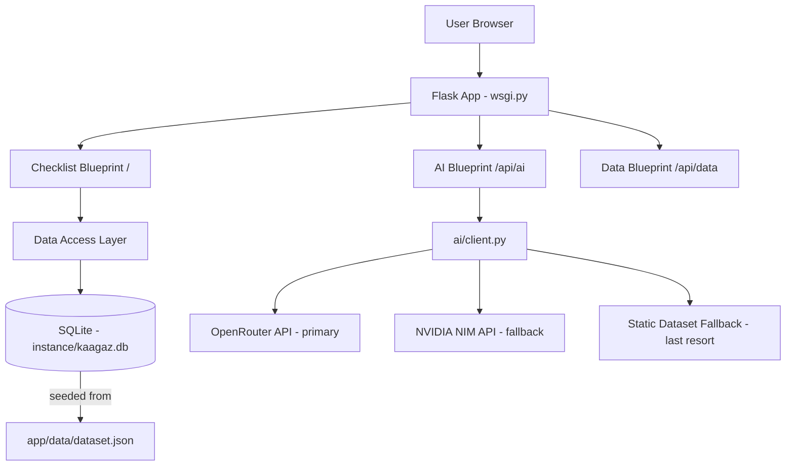
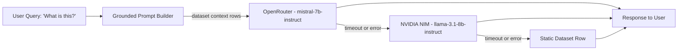
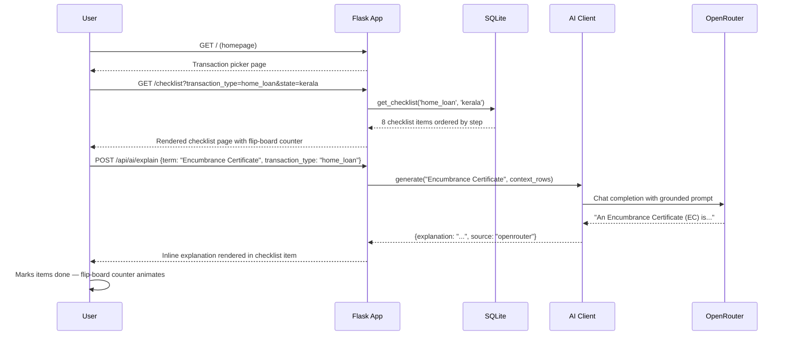

# Kaagaz

Banking document checklist web application for Indian residents and NRIs.

---

## 1. Overview

Kaagaz is a web application for Indian residents and NRIs navigating routine banking transactions. It generates a single ordered, costed checklist of required documents for a given transaction type — home loan, NRI account opening, property sale deed registration, or business current account opening — based on a curated dataset of banking, RBI, and state regulatory requirements.

The target user is anyone who has ever arrived at a bank counter missing a document they did not know they needed.

---

## 2. Problem and Motivation

In India, each major banking transaction demands a specific bundle of documents, attestations, stamps, and government forms whose requirements are scattered across bank websites, RBI circulars, state stamp-duty schedules, and registrar office notices. A person applying for a home loan in Kerala may not know that the loan agreement requires a state-specific adhesive stamp of a particular denomination, or that an Encumbrance Certificate has a processing fee and a lead time of several working days. People discover missing items at the counter — causing repeat visits, missed appointments, and in some cases missed financial deadlines.

Kaagaz addresses this by surfacing the complete list, in order, with costs and timelines, before the person leaves the house.

---

## 3. Architecture

### Application Layer



### AI Request Path



The AI client in [`app/ai/client.py`](app/ai/client.py) builds a grounded prompt that includes the relevant dataset rows for the current transaction type before dispatching to OpenRouter. If OpenRouter times out or returns an error, the request falls through to NVIDIA NIM. If that also fails, the client returns the description field from the matching static dataset row. The user always receives a response.

---

## 4. Sequence Diagram

Complete user flow from homepage to checklist interaction:



---

## 5. Data Model

Each entry in `dataset.json` maps to a row in the `checklist_items` table. The schema is:

| Column               | Type    | Description                                                                 |
|----------------------|---------|-----------------------------------------------------------------------------|
| `id`                 | INTEGER | Primary key                                                                 |
| `transaction_type`   | TEXT    | One of: `home_loan`, `nri_account`, `property_registration`, `current_account` |
| `state`              | TEXT    | `kerala`, `maharashtra`, or `all` (applies to all states)                  |
| `step`               | INTEGER | Ordering within the checklist for this transaction type                     |
| `document_name`      | TEXT    | Short display name of the document or item                                  |
| `description`        | TEXT    | Plain-language explanation of what the document is and where to obtain it   |
| `estimated_cost_inr` | INTEGER | Approximate cost in Indian Rupees; 0 if no fee applies                      |
| `lead_time_days`     | INTEGER | Working days typically required to obtain the document; 0 if immediate      |
| `regulatory_source`  | TEXT    | Authority mandating this requirement (see below)                            |
| `is_mandatory`       | BOOLEAN | Whether the item is mandatory or conditional                                |

### Regulatory Source Values

The `regulatory_source` field carries one of four values:

- `rbi` — Requirement is mandated or regulated by the Reserve Bank of India (e.g. KYC norms, FEMA declarations for NRI accounts, loan-processing documentation).
- `state_stamp_act` — Requirement is governed by the relevant state's Stamp Act (e.g. stamp duty on property transactions, adhesive stamps on loan agreements).
- `registrar` — Requirement comes from the state Registrar of Assurances or Sub-Registrar office (e.g. registration fees, encumbrance certificate).
- `bank_internal` — Requirement is a bank's own internal policy (e.g. employment letter format, salary slip count).

**Important note on state subjects:** Stamp duty rates, registration fees, and adhesive stamp requirements are state subjects under the Indian Constitution. They are not set by the RBI and must never be attributed to the RBI in any user-facing text. The `regulatory_source` field enforces this distinction in the data layer; the UI renders the source label accordingly.

---

## 6. Setup Instructions

```bash
# Clone the repository
git clone <repo-url>
cd kaagaz

# Create and activate virtual environment (required — never install globally)
python -m venv venv
source venv/bin/activate      # On Windows: venv\Scripts\activate

# Install dependencies
pip install -r requirements.txt

# Configure environment variables
cp .env.example .env
# Edit .env and add your API keys:
# OPENROUTER_API_KEY=your_key_here
# NVIDIA_NIM_API_KEY=your_key_here
# SECRET_KEY=your_random_secret

# Run the app
flask run
# or: python wsgi.py
```

The SQLite database is created automatically at `instance/kaagaz.db` on first run, seeded from `app/data/dataset.json`. No manual database setup is required.

---

## 7. Project Structure

```
kaagaz/
  app/
    __init__.py              Flask app factory
    checklist/               Blueprint: transaction picker, checklist routes
      __init__.py
      routes.py
    ai/                      Blueprint: LLM abstraction and fallback
      __init__.py
      client.py              generate() with OpenRouter -> NIM -> static fallback
      routes.py
    data/                    Blueprint: dataset access
      __init__.py
      access.py              get_checklist(), search_dataset()
      dataset.json           Curated document requirements (hand-built)
      db_seed.py             SQLite seeding from dataset.json
      routes.py
    static/
      css/main.css           Full hand-written CSS (paper-collage aesthetic)
      js/flipboard.js        Flip-board counter and status animation component
    templates/
      base.html              Base Jinja2 template with header/footer
      index.html             Transaction picker
      checklist.html         Checklist with AI explainer and flip-board
  .aimem/                    Persistent cross-agent context and build log
  tests/
    test_basic.py
  .env.example
  .gitignore
  requirements.txt
  README.md
  vercel.json
  wsgi.py
```

---

## 8. Scope and Limitations

### Coverage

Kaagaz covers exactly four transaction types:

- Home loan application (salaried)
- NRI account opening (NRE/NRO)
- Property sale deed registration with linked loan disbursement
- Business current account opening (proprietorship, partnership, private limited)

State-specific requirements (stamp duty, registration fees) are provided for Kerala and Maharashtra only. The data model is designed so that adding a third state requires data entry only, not code changes.

### Disclaimer

Kaagaz is an informational prototype. All cost estimates and procedural requirements are based on publicly available guidance and the curated dataset as of 2026. Figures should be verified with the relevant bank, Sub-Registrar office, or qualified professional before relying on them for any transaction. This tool is not legal or financial advice.

### Features Not Included

- Live document upload or verification
- OCR
- Actual e-stamping or payment integration
- User accounts or saved checklists
- Multi-language support (English only)

---

## 9. How IBM Bob 2.0 Was Used

IBM Bob 2.0 (agent mode) was the primary development partner for the entire Kaagaz build. Bob generated the complete Flask application skeleton, all Blueprint route files, the SQLite seeding pipeline, the AI client abstraction with fallback logic, the grounded prompt templates, and the full hand-written CSS and vanilla JS frontend including the flip-board animation component. Bob also curated the document-requirement dataset for all four transaction types across Maharashtra and Kerala, applying the RBI-vs-state regulatory distinction consistently throughout.

Bob's parallel subagent workflow was used to run backend development, data curation, frontend design, and documentation as simultaneous workstreams, which would have taken the better part of a day to serialize manually. The `.aimem/` folder was maintained throughout the session as a persistent cross-agent context store, giving each subagent full project context without re-derivation. Every architectural decision — model selection, deployment time-box, SQLite seeding strategy, grounding approach — was logged to `.aimem/decisions.md` by Bob in real time.

The closest IBM Bob workflow match is application development and maintenance. Bob was not just generating boilerplate but making architectural decisions, enforcing regulatory accuracy constraints across multiple files, and coordinating a multi-workstream build under hackathon time pressure.

---

## 10. License

MIT License. See [LICENSE](LICENSE).
